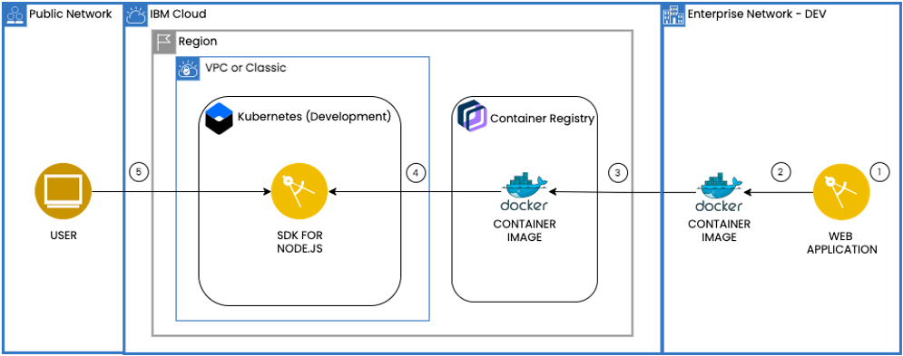

    

    
    
    

# Scalable web application on Kubernetes

> This repository is a companion code sample for a [solution tutorial](https://cloud.ibm.com/docs/solution-tutorials?topic=solution-tutorials-scalable-webapp-kubernetes)

This tutorial walks you through how to run a web application locally in a container, build a container image and push the image to a private registry and then deploy it to a Kubernetes cluster created with [Kubernetes Service](https://cloud.ibm.com/kubernetes/catalog/cluster). Additionally, you will learn how to bind a custom subdomain, monitor the health of the environment, and scale the application.

Containers are a standard way to package apps and all their dependencies so that you can seamlessly move the apps between environments. Unlike virtual machines, containers do not bundle the operating system. Only the app code, run time, system tools, libraries, and settings are packaged inside containers. Containers are more lightweight, portable, and efficient than virtual machines.

For developers looking to kickstart their projects, the IBM Cloud Developer Tools CLI enables rapid application development and deployment by generating template applications that you can run immediately or customize as the starter for your own solutions. In addition to generating starter application code, Docker container image and CloudFoundry assets, the code generators used by the dev CLI and web console generate files to aid deployment into [Kubernetes](https://kubernetes.io/) environments. The templates generate Helm charts that describe the application’s initial Kubernetes deployment configuration, and are easily extended to create multi-image or complex deployments as needed.

For step-by-step instructions, refer this [tutorial](https://cloud.ibm.com/docs/solution-tutorials?topic=solution-tutorials-scalable-webapp-kubernetes)

[The tutorials are part of the IBM Cloud documentation](https://cloud.ibm.com/docs/solution-tutorials?topic=solution-tutorials-tutorials#tutorials).

### Starter application
The starter application is scaffolded using [IBM Cloud Developer Tools CLI](https://cloud.ibm.com/docs/apps?topic=apps-create-deploy-app-cli) `ibmcloud dev`.

This starter application is a simple microservice that incorporates the [Express web framework](https://expressjs.com/) to provide a landing page and two endpoints. Use this repository as a template for your own application.

- The [Swagger UI](http://swagger.io/swagger-ui/) is running on: `/swagger/api-docs`
- Health endpoint: `/health`